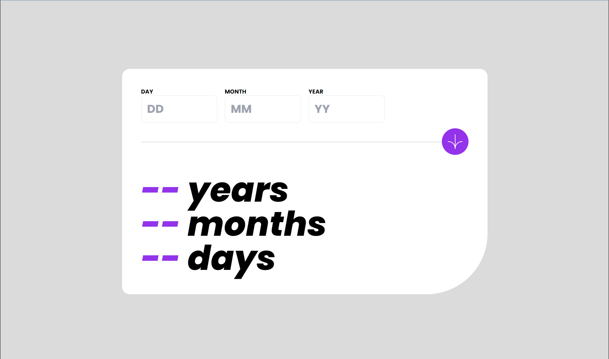

# Frontend Mentor - Age calculator app solution

This is a solution to the [Age calculator app challenge on Frontend Mentor](https://www.frontendmentor.io/challenges/age-calculator-app-dF9DFFpj-Q). Frontend Mentor challenges help you improve your coding skills by building realistic projects.

## Table of contents

- [Frontend Mentor - Age calculator app solution](#frontend-mentor---age-calculator-app-solution)
  - [Table of contents](#table-of-contents)
  - [Overview](#overview)
    - [The challenge](#the-challenge)
    - [Screenshot](#screenshot)
    - [Links](#links)
  - [My process](#my-process)
    - [Built with](#built-with)
    - [What I learned](#what-i-learned)
    - [Continued development](#continued-development)
    - [Useful resources](#useful-resources)
  - [Author](#author)

**Note: Delete this note and update the table of contents based on what sections you keep.**

## Overview

### The challenge

Users should be able to:

- View an age in years, months, and days after submitting a valid date through the form
- Receive validation errors if:
  - Any field is empty when the form is submitted
  - The day number is not between 1-31
  - The month number is not between 1-12
  - The year is in the future
  - The date is invalid e.g. 31/04/1991 (there are 30 days in April)
- View the optimal layout for the interface depending on their device's screen size
- See hover and focus states for all interactive elements on the page
- **Bonus**: See the age numbers animate to their final number when the form is submitted

### Screenshot

### Links

- Solution URL: [github.com/Charlie025x/age-calculator-app](https://github.com/Charlie025x/age-calculator-app)
- Live Site URL: [charlie025x.github.io/age-calculator-app/](https://charlie025x.github.io/age-calculator-app/)

## My process

### Built with

- CSS Grid
- Mobile-first workflow
- [React](https://reactjs.org/) - JS library
- [React Hook Form](https://react-hook-form.com/) - React Form library
- [Tailwind CSS](https://tailwindcss.com/) - A utility-first CSS framework
- [Typescript ](https://www.typescriptlang.org/) - TypeScript adds additional syntax to JavaScript

### What I learned

This is my first project where I utilized Typescript. I started the project confident as I declared my types, but I eventually ran into 'type may potentialy be undefined' errors. That error had be spinning my gears but I pulled through with conditional type checks. I also got to refresh myself on the React Hook Form libary, a great tool for building forms in React.

### Continued development

I want to continue practicing Typescript. I'm almost certain I will be hating this decision when I'm fighting typescript errors in the future, but I know it will help me build skills that will easily transfer to other programming language. While I was developing with React-Hook-Form I learned of a tool called Zod that pairs well with React-Hook-Form and alows for a better authentication expirence when writing forms. I'd like to try Zod in the near future.

### Useful resources

- [React Hook Form Tutorials | Codevolution](https://youtube.com/playlist?list=PLC3y8-rFHvwjmgBr1327BA5bVXoQH-w5s&si=CKVyDrt2K5rPt3_D) - This YouTube playlist contains video tutorials on React-Hook-Form. React Hook Form is a npm package that makes working with Forms a little easier on a React envirnment. This playlist is great for teaching the ins and outs of the package, it especialy helped me with form error and state handleing.

## Author

- Website - [Charlie Alonso](https://charlie025x.github.io/myPortfolio-tailwind/)
- GitHub - [Charlie025x](https://github.com/Charlie025x)
- Frontend Mentor - [@Charlie025x](https://www.frontendmentor.io/profile/Charlie025x)
- LinkedIn - [Charliealonso002](https://www.linkedin.com/in/charliealonso002/)
